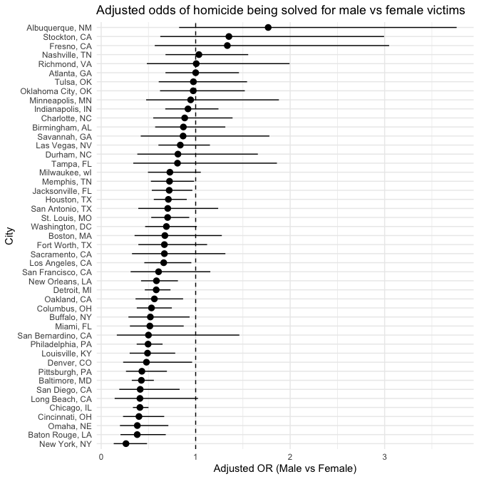
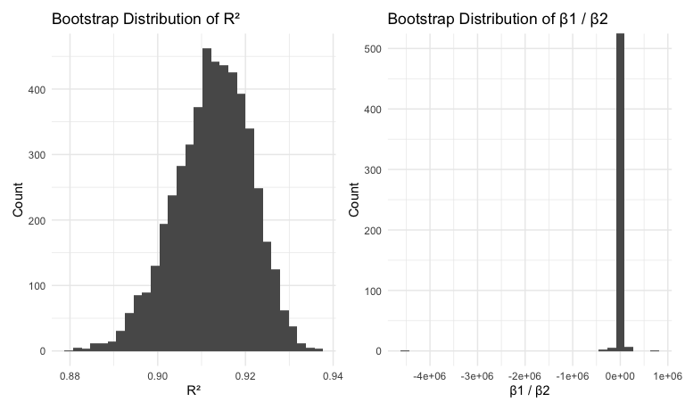

p8105_hw6_xl3494
================
Selina Lyu

## Problem 1

**Import the raw data**

``` r
hom_raw = readr::read_csv("https://raw.githubusercontent.com/washingtonpost/data-homicides/master/homicide-data.csv")
```

    ## Rows: 52179 Columns: 12
    ## ── Column specification ────────────────────────────────────────────────────────
    ## Delimiter: ","
    ## chr (9): uid, victim_last, victim_first, victim_race, victim_age, victim_sex...
    ## dbl (3): reported_date, lat, lon
    ## 
    ## ℹ Use `spec()` to retrieve the full column specification for this data.
    ## ℹ Specify the column types or set `show_col_types = FALSE` to quiet this message.

**Clean the dataset**

``` r
hom = 
  hom_raw |>
  mutate(city_state = str_c(city,", ", state),
         solved = disposition == "Closed by arrest",
         victim_age = as.numeric(victim_age)) |>
  mutate(solved = as.integer(solved)) |>
  filter(
    !city_state %in% c("Dallas, TX", "Phoenix, AZ",
                       "Kansas City, MO", "Tulsa, AL"),
    victim_race %in% c("White", "Black"),
    !is.na(victim_age)
  )
```

    ## Warning: There was 1 warning in `mutate()`.
    ## ℹ In argument: `victim_age = as.numeric(victim_age)`.
    ## Caused by warning:
    ## ! NAs introduced by coercion

**For the city of Baltimore, MD, use the glm function to fit a logistic
regression with resolved vs unresolved as the outcome and victim age,
sex and race as predictors.**

``` r
fit_balt =
  hom |>
  filter(city_state == "Baltimore, MD") |>
  mutate(
    victim_sex  = fct_relevel(victim_sex, "Female"),
    victim_race = fct_relevel(victim_race, "White")) |>
  glm(
  solved ~ victim_age + victim_sex + victim_race,
  data = _, family = binomial)


fit_balt_tidy =
  fit_balt |>
  broom::tidy(conf.int = TRUE) |>
  mutate(OR = exp(estimate), 
         lower_ci = exp(conf.low),
         upper_ci = exp(conf.high)) |>
  select(term, log_OR = estimate, OR, lower_ci, upper_ci, p.value) |> 
  knitr::kable(digits = 3)

fit_balt_tidy
```

| term             | log_OR |    OR | lower_ci | upper_ci | p.value |
|:-----------------|-------:|------:|---------:|---------:|--------:|
| (Intercept)      |  1.152 | 3.164 |    1.998 |    5.057 |   0.000 |
| victim_age       | -0.007 | 0.993 |    0.987 |    1.000 |   0.043 |
| victim_sexMale   | -0.854 | 0.426 |    0.324 |    0.558 |   0.000 |
| victim_raceBlack | -0.842 | 0.431 |    0.305 |    0.606 |   0.000 |

Male victims’ homicide cases are about 57% less likely to be solved than
female victims (OR = 0.426), holding age and race constant. We are 95%
confident that the true odds ratio lies between 0.324 and 0.558.

**Now run glm for each of the cities in your dataset, and extract the
adjusted odds ratio (and CI) for solving homicides comparing male
victims to female victims. **

``` r
city_or =
  hom |>
  mutate(
    victim_sex  = fct_relevel(victim_sex,  "Female"),
    victim_race = fct_relevel(victim_race, "White")
  ) |>
  group_by(city_state) |>
  nest() |>
  mutate(
    models  = map(data, \(df) glm(
      solved ~ victim_age + victim_sex + victim_race,
      data = df, family = binomial)),
    results = map(models, \(m) tidy(m, conf.int = TRUE))
  ) |>
  unnest(results) |>
  filter(term == "victim_sexMale") |>
  mutate(
    OR    = exp(estimate),
    lower = exp(conf.low),
    upper = exp(conf.high)
  ) |>
  select (city_state, term, OR, lower, upper, p.value)

city_or
```

    ## # A tibble: 47 × 6
    ## # Groups:   city_state [47]
    ##    city_state      term              OR lower upper   p.value
    ##    <chr>           <chr>          <dbl> <dbl> <dbl>     <dbl>
    ##  1 Albuquerque, NM victim_sexMale 1.77  0.825 3.76  1.39 e- 1
    ##  2 Atlanta, GA     victim_sexMale 1.00  0.680 1.46  1.000e+ 0
    ##  3 Baltimore, MD   victim_sexMale 0.426 0.324 0.558 6.26 e-10
    ##  4 Baton Rouge, LA victim_sexMale 0.381 0.204 0.684 1.65 e- 3
    ##  5 Birmingham, AL  victim_sexMale 0.870 0.571 1.31  5.11 e- 1
    ##  6 Boston, MA      victim_sexMale 0.674 0.353 1.28  2.26 e- 1
    ##  7 Buffalo, NY     victim_sexMale 0.521 0.288 0.936 2.90 e- 2
    ##  8 Charlotte, NC   victim_sexMale 0.884 0.551 1.39  6.00 e- 1
    ##  9 Chicago, IL     victim_sexMale 0.410 0.336 0.501 1.86 e-18
    ## 10 Cincinnati, OH  victim_sexMale 0.400 0.231 0.667 6.49 e- 4
    ## # ℹ 37 more rows

**Create a plot that shows the estimated ORs and CIs for each city.**

``` r
city_or |>
  ungroup() |>
  arrange(OR) |> 
  mutate(city_state = fct_reorder(city_state, OR)) |>
  ggplot(aes(x = city_state, y = OR, ymin = lower, ymax = upper)) +
  geom_pointrange() +
  geom_hline(yintercept = 1, linetype = "dashed") +
  coord_flip() +
  labs(
    x = "City",
    y = "Adjusted OR (Male vs Female)",
    title = "Adjusted odds of homicide being solved for male vs female victims"
  )
```


According to the plot, the odds ratios in most cities are below 1,
indicating that cases involving male victims are less likely to be
solved than those involving female victims after adjusting for age and
race. Cites like Omaha, NE, Baton Rouge, LA, and New York, NY show
significant sex differences with confidence intervals excluding 1.
However, cities like Albuquerque, NM, Stockton, CA, and Fresno, CA have
odds ratios higher than 1, but sex difference is not significant with
confidence intervals including 1.

## Problem 2

**Load and prep the Central Park weather data**

``` r
library(p8105.datasets)
data("weather_df")

weather = weather_df |>
  filter(name == "CentralPark_NY") |>
  select(name, tmax, tmin, prcp) |>
  drop_na()
```

**Bootstrap and fit linear regression**

``` r
boot_res =
  tibble(strap_number = 1:5000) |>
  mutate(
    boot_samp = map(strap_number, \(i) sample_frac(weather, size = 1, replace = TRUE)),
    fit = map(boot_samp, \(df) lm(tmax ~ tmin + prcp, data = df)),
    r2 = map_dbl(fit, \(m) glance(m)$r.squared),
    results = map(fit, broom::tidy)) |>
  select(-boot_samp, -fit) |>
  unnest(results) |>
  group_by(strap_number) |>
  summarize(
    r2 = unique(r2),
    b1 = estimate[term == "tmin"],
    b2 = estimate[term == "prcp"],
    ratio = b1 / b2)

boot_res
```

    ## # A tibble: 5,000 × 5
    ##    strap_number    r2    b1        b2  ratio
    ##           <int> <dbl> <dbl>     <dbl>  <dbl>
    ##  1            1 0.913  1.04 -0.00439   -237.
    ##  2            2 0.921  1.04 -0.00245   -424.
    ##  3            3 0.905  1.03 -0.000690 -1492.
    ##  4            4 0.921  1.06 -0.00290   -364.
    ##  5            5 0.906  1.02 -0.00222   -461.
    ##  6            6 0.915  1.04 -0.00164   -634.
    ##  7            7 0.919  1.04 -0.00129   -808.
    ##  8            8 0.905  1.04 -0.000428 -2435.
    ##  9            9 0.917  1.05 -0.00145   -723.
    ## 10           10 0.916  1.04 -0.00303   -344.
    ## # ℹ 4,990 more rows

**Plots**

Plot the distribution of r2

``` r
p1 = 
  boot_res |>
  ggplot(aes(x = r2)) +
  geom_histogram() +
  labs(title = "Bootstrap Distribution of R²",
       x = "R²", y = "Count")
```

Plot the distribution of b1/b2

``` r
p2 = 
  boot_res |>
  ggplot(aes(x = ratio)) +
  geom_histogram() +
  coord_cartesian(ylim = c(0, 500)) +
  labs(title = "Bootstrap Distribution of β1 / β2",
       x = "β1 / β2", y = "Count")
```

``` r
p1 + p2
```

    ## `stat_bin()` using `bins = 30`. Pick better value with `binwidth`.
    ## `stat_bin()` using `bins = 30`. Pick better value with `binwidth`.



95% CI’s:

``` r
boot_res |>
  summarize(
    r2_low  = quantile(r2, 0.025),
    r2_high = quantile(r2, 0.975),
    ratio_low  = quantile(ratio, 0.025),
    ratio_high = quantile(ratio, 0.975)) |>
  knitr::kable(digits = 3)
```

| r2_low | r2_high | ratio_low | ratio_high |
|-------:|--------:|----------:|-----------:|
|  0.894 |   0.928 | -5616.445 |   4586.923 |

The left plot displays the bootstrap distribution of R² from repeatedly
refitting the linear regression model. The distribution is symmetric and
unimodal and centered around 0.91, indicating that the model
consistently explains about 91% of the variation in daily maximum
temperature across bootstrap samples. The spread is narrow (95% CI:
0.894, 0.928), suggesting that the R² estimate is stable and not
sensitive to resampling.

In contrast, the second plot shows the bootstrap distribution of β1 /
β2, the ratio of the estimated coefficients for tmin and prcp. The
distribution is extremely skewed and dominated by a tall spike near
zero, with a few very large positive and negative values extending far
out on the x-axis. This pattern occurs because the precipitation
coefficient (β2) is very close to zero, so small random variation in its
estimate causes the ratio β1 / β2 to become very large in magnitude.
